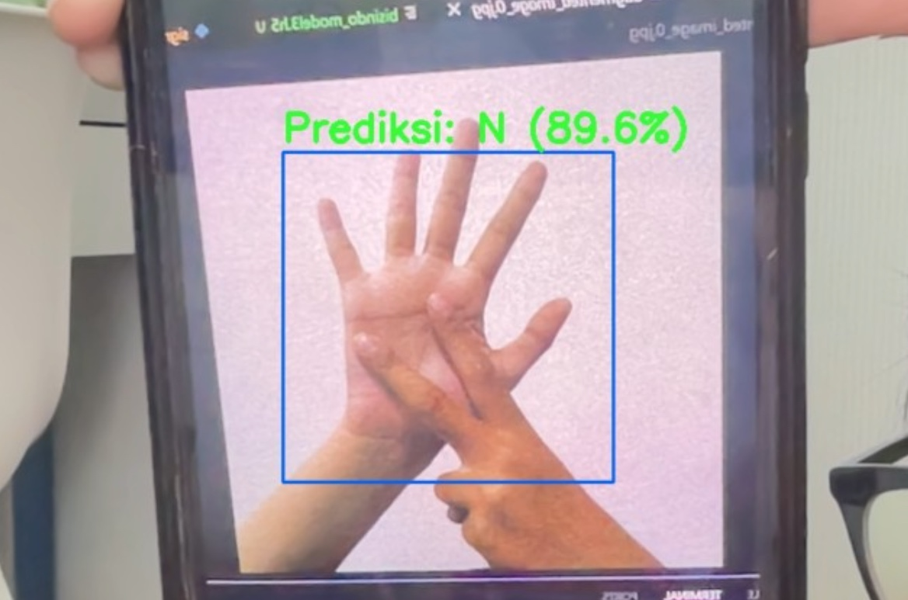

# Deteksi Huruf Bisindo

Anggota : 
- Nikita Putri Prabowo (140810230010)
- Audrey Shaina Tjandra (140810230026)

# Deskripsi Aplikasi

- Aplikasi Pendeteksi Huruf BISINDO merupakan sebuah sistem berbasis computer vision dan machine learning yang dirancang untuk mengenali dan menerjemahkan gerakan tangan pengguna ke dalam huruf alfabet sesuai dengan standar Bahasa Isyarat Indonesia (BISINDO). 

- Tujuan utama aplikasi ini adalah untuk membantu jembatan komunikasi antara teman tuli dengan masyarakat luas, serta sebagai media pembelajaran interaktif bagi pengguna yang ingin belajar BISINDO.

# Python untuk pemrograman inti.

- Python untuk pemrograman inti.
- OpenCV untuk pengolahan citra.
- TensorFlow untuk deteksi tangan.
- TensorFlow untuk pelatihan dan prediksi model huruf.

# Masalah yang di selesaikan

Komunikasi antara teman tuli dan orang non-disabilitas masih menjadi tantangan, terutama karena keterbatasan dalam memahami Bahasa Isyarat Indonesia (BISINDO). Proyek ini bertujuan untuk:
- Membantu pengguna (khususnya non-disabilitas) memahami alfabet BISINDO.
- Mendeteksi huruf yang diisyaratkan secara real-time menggunakan kamera.
- Meningkatkan inklusivitas teknologi terhadap penyandang disabilitas.

# Model AI yang digunakan 

Model yang digunakan dalam proyek ini adalah Convolutional Neural Network (CNN), yaitu jenis kecerdasan buatan yang biasa digunakan untuk mengenali gambar. Model ini dilatih agar bisa mengenali gambar tangan dan mengklasifikasikannya menjadi huruf A sampai Z.

Proses pendeteksian huruf dilakukan melalui beberapa tahap:
- Pelacakan Tangan (Hand Tracking): Untuk mendeteksi posisi tangan secara langsung dari kamera.
- Pemrosesan Gambar (Preprocessing): Gambar tangan yang terdeteksi kemudian di-crop dan disesuaikan ukurannya agar mudah dikenali oleh model.
- Pelatihan Model (Training): Gambar-gambar tersebut digunakan untuk melatih model CNN, yang terdiri dari 3 sampai 5 lapisan. Model ini belajar membedakan setiap bentuk tangan berdasarkan hurufnya. Optimasi dilakukan menggunakan metode Adam dengan fungsi kesalahan categorical_crossentropy.
- Prediksi (Prediction): Setelah dilatih, model dapat menebak huruf apa yang sedang diperagakan oleh tangan hanya dari gambar yang ditangkap kamera.

Framework:
- Python 
- TensorFlow / Keras
- OpenCV

# Dataset yang Digunakan

(https://www.kaggle.com/datasets/agungmrf/indonesian-sign-language-bisindo)

# Hasil Testing

